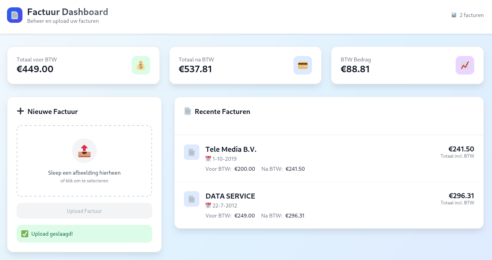

# AI-boekhoud assistent

AI-boekhoud assistent is een applicatie die zelfstandige ondernemers helpt om hun administratie te automatiseren. Je kunt eenvoudig facturen uploaden, waarna de AI automatisch leveranciers, bedragen en btw-waarden herkent en toont in een overzichtelijk dashboard.



## Functionaliteiten

- Upload van facturen via drag & drop of selectie
- Automatische herkenning van factuurgegevens (leverancier, datum, bedragen)
- Dashboard met totaalbedragen voor en na btw
- Backend met AI-verwerking via OpenAI API
- Frontend gebouwd met Vite + React

---

## Installatie

### 1. Repository clonen

```bash
git clone https://github.com/DDE-64-bit/AI-boekhouder.git
cd AI-boekhouder
```

---

## 2. `.env` bestand aanmaken

Maak **één** `.env` bestand aan in de **hoofdmap van het project** met de volgende inhoud:

```
OPENAI_API_KEY=your-openai-api-key
```

Deze key wordt uitsluitend door de **backend** gebruikt. De frontend maakt geen direct gebruik van de OpenAI API of van deze sleutel.

---

## Backend (Django)

### Installatie

```bash
cd backend
python -m venv venv
source venv/bin/activate  # Of venv\Scripts\activate op Windows
pip install -r requirements.txt
```

### Server starten

```bash
python manage.py makemigrations
python manage.py migrate
python manage.py runserver
```

Backend draait op: `http://localhost:8000/`

---

## Frontend (Vite + React)

### Installatie

```bash
cd frontend
npm install
```

### Server starten

```bash
npm run dev
```

Frontend draait op: `http://localhost:5173/`

> Let op: de frontend communiceert met de backend en gebruikt **geen directe toegang tot de OpenAI API** of de `.env` variabele.

---

## Structuur

```
AI-boekhouder/
├── backend/              # Django backend
├── frontend/             # Vite + React frontend
├── .env                  # Bevat alleen OPENAI_API_KEY
└── README.md
```

---

## Licentie

MIT-licentie
